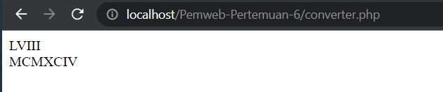

# Pemweb-Pertemuan-6
Tugas Praktikum Pemrogram Web Pertemuan 6

M Nuur Arinda M (120140145)
Kelas Pemweb (RB), Praktikum Pemweb Jadwal (A)

> Program yang dapat mengubah bilangan integer menjadi bilangan romawi

Output

Hasil dari bilangan integer yang telah diubah menjadi bilangan romawi

